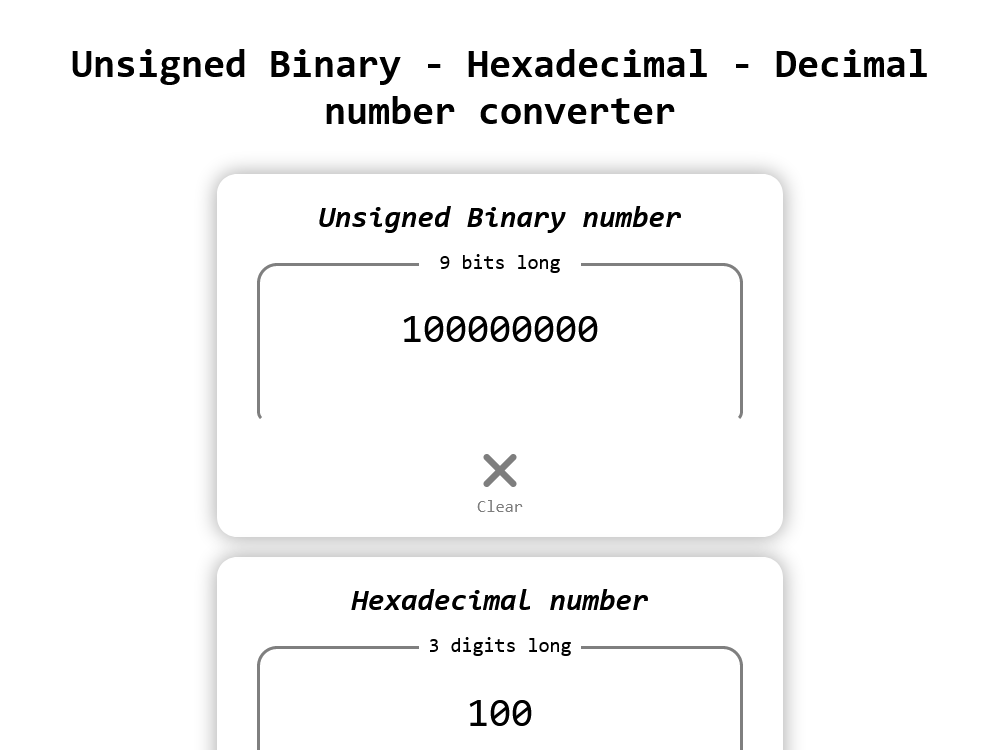

# Unsigned Binary - Hexadecimal - Decimal number converter

## Convert between number notations:

-   Unsigned Binary and Decimal.

---

-   Unsigned Binary and Hexadecimal.

---

-   Decimal and Hexadecimal.

---

[Run the App!](https://new-af.github.io/)

